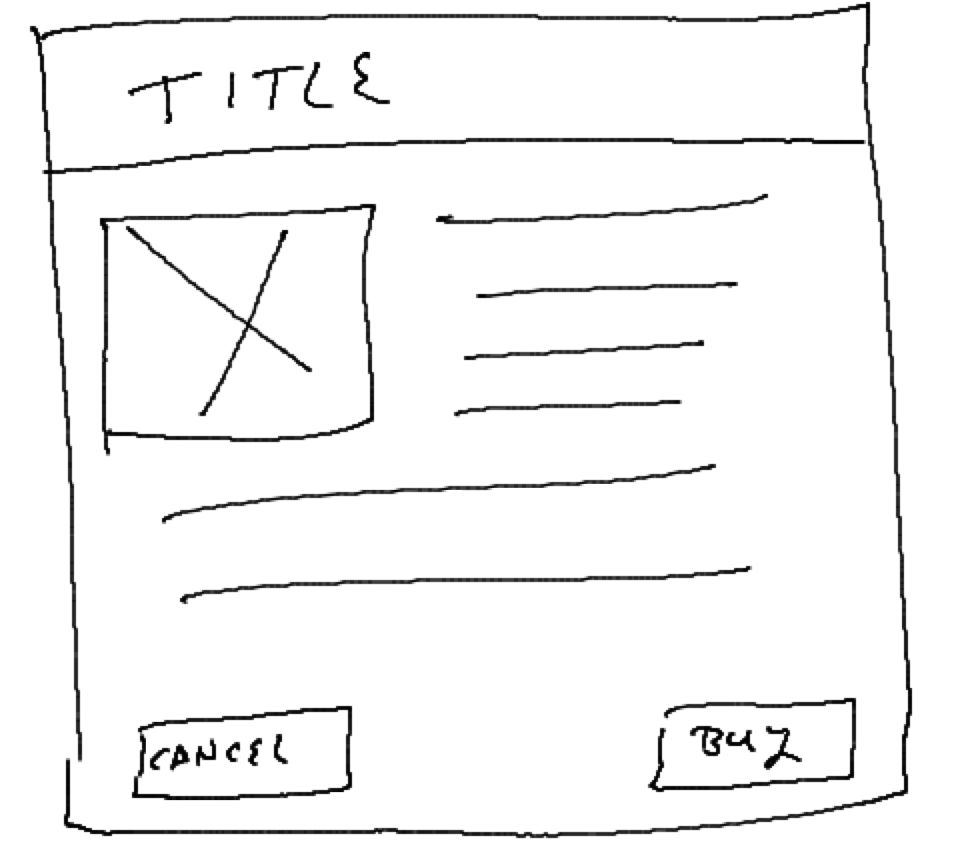

# 301 Mid-Term Skills Assessment

## Execution Instructions

1. Create a new repository for your work, called `301-assessment`
1. Create this repository using the github.com options to create both a README.md and a .gitignore (Node)
1. Work in a non-master branch
1. Commit and push your work frequently
1. Create a Pull Request when you are finished and merge to your `master` branch
1. Submit a link to this Pull Request for grading purposes

## Questions

In your **README.md**, write the answers to the following questions.  Please state the question in bold text, and the answer beneath it in either normal text or formatted for code.

1. **In a Handlebars template, what does `{{city}}` refer to?**
1. **Explain how the following code in a Node-express server is triggered to run, and what it's output is**

   ```javascript
   server.get('/list', (request, response) => {
      let animals = ['Cat','Dog','Sheep'];
      response.send(200).json(animals);
   });
   ```

1. **Write a Constructor function that can create an instance of a person, with a name and an age, given 2 arguments**

   ```javascript
   Your code goes here
   ```

## Application

Build a website with the following features.

1. One page (index.html)
1. Header with your name
1. Footer with the name of this course
1. Content area to show 2 short pieces of content
1. Style the header with a black background and white text
1. Style footer with dark grey background and black text
1. Style the content area with a near-white background
1. In this content area create 2 divs, called "cards", each with:
   - Title 
   - Image
     - Use this URL for the image: <http://placehold.it/200x125>
   - Paragraph with some random text
   - 2 Links
1. Style the cards to each appear as shown in the image below
1. Place the two cards on the page in the content area, side by side, evenly spaced.
1. When the "Buy" button on a card is clicked, send a message to the console that says "Thank you!"
1. When the "Cancel" button on a card is clicked, hide the card.
  
---



> Assessment v1.02

<!--
    Grading Notes:  80% to pass
    - Questions: 5% each (15%) 
    - Operational Application - all features met (35%)
    - Have proper, standard, semantic HTML structure (20%)
    - Use proper CSS (bonus for good SMACSS) (20%)
    - Use jQuery properly for event handling (10%)
-->
